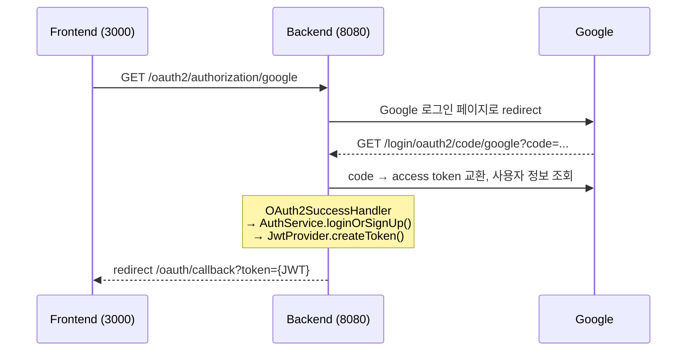

# 인증 설계: Google OAuth2 + JWT

> 최종 수정: 2026-10-06

## 1. 개요

- 로그인은 **Google OAuth2만** 지원한다. 자체 회원가입이나 비밀번호 로그인은 없다.
- 로그인에 성공하면 서버가 **JWT(Access Token)** 를 발급하고, 이후 API는 이 토큰으로 인증한다.
- 서버는 세션을 쓰지 않는다(`STATELESS`).
- 처음 로그인하는 사용자는 자동으로 회원가입된다.

## 2. 인증 흐름

### 2-1. 로그인 (토큰 발급)



1. 프론트가 `/oauth2/authorization/google`로 이동한다. 이 경로는 Spring Security가 기본으로 제공한다.
2. Google 로그인과 동의를 마치면 Google이 인증 코드를 붙여 `/login/oauth2/code/google`로 돌려보낸다.
3. Spring Security가 코드를 토큰으로 교환하고 사용자 정보(`sub`, `email`, `name`, `picture`)를 가져온다.
4. `OAuth2SuccessHandler`가 회원을 조회하거나 가입시킨 뒤 JWT를 발급한다.
5. 프론트 콜백 URL에 `?token=`을 붙여 redirect한다.

> 브라우저에 이미 Google 로그인과 동의가 되어 있으면 2번 화면 없이 바로 콜백으로 이동한다.

### 2-2. API 요청 (토큰 검증)

```
Client ──(Authorization: Bearer {JWT})──▶ JwtAuthenticationFilter
          ├ 유효   → SecurityContext에 userId 등록 → Controller
          └ 무효/없음 → 인증 없이 진행 → 보호된 URL이면 401
```

컨트롤러에서는 `@AuthenticationPrincipal Long userId`로 로그인한 사용자 ID를 받는다.

## 3. 파일별 역할 정리

| 패키지 / 파일 | 역할 |
|---|---|
| `SecurityConfig` | 보안 규칙. 허용 URL, STATELESS, OAuth2 로그인 성공 핸들러, JWT 필터 등록 |
| `user/User` | `users` 테이블 엔티티 |
| `user/Provider` | 로그인 제공자 enum (`google`) |
| `user/Role` | 권한 enum (`USER`). JWT의 `role` 클레임에 들어감 |
| `user/UserRepository` | `findByProviderAndProviderId`로 소셜 계정 기준 회원 조회 |
| `user/UserService` | 회원 비즈니스 로직 (현재 비어 있음) |
| `user/UserController` | 회원 API (`/user/me`) |
| `user/auth/AuthService` | Google 사용자 정보로 로그인 또는 회원가입 처리 |
| `user/handler/OAuth2SuccessHandler` | OAuth2 성공 시 회원 확보, JWT 발급, 프론트로 redirect |
| `user/jwt/JwtProvider` | JWT 생성, 검증, 클레임(userId, role) 추출 |
| `user/jwt/JwtAuthenticationFilter` | 요청마다 Bearer 토큰을 검증해 인증 정보 등록 |

## 4. JWT 명세

| 항목 | 값 |
|---|---|
| 알고리즘 | HS512 (`JWT_SECRET` 기반 HMAC) |
| `sub` | 회원 ID (`users.id`) |
| `role` | `USER` 등 |
| `iat` / `exp` | 발급 시각 / 만료 시각 |
| 유효기간 | 1시간 (`jwt.expiration-ms: 3600000`) |
| 전달 방식 | `Authorization: Bearer {token}` |

** Refresh Token 설정 필요. 만료되면 다시 로그인해야 한다.

## 5. 설정

| 키 | 설명 | 출처 |
|---|---|---|
| `spring.security.oauth2.client.registration.google.client-id` | Google OAuth 클라이언트 ID | `.env` `GOOGLE_CLIENT_ID` |
| `...google.client-secret` | Google OAuth 시크릿 | `.env` `GOOGLE_CLIENT_SECRET` |
| `jwt.secret` | JWT 서명 키 (HS512는 64바이트 이상) | `.env` `JWT_SECRET` |
| `jwt.expiration-ms` | 토큰 만료 시간(ms) | `application.yml` |
| `app.oauth2.redirect-uri` | 로그인 성공 후 이동할 프론트 주소 | `application.yml` |

Google Cloud Console 설정:
- 승인된 리디렉션 URI: `http://localhost:8080/login/oauth2/code/google`
- 동의 화면이 "테스트" 상태면 테스트 사용자로 등록된 계정만 로그인할 수 있다.

## 6. API

| Method | URL | 인증 | 설명 |
|---|---|---|---|
| GET | `/oauth2/authorization/google` | X | Google 로그인 시작 |
| GET | `/login/oauth2/code/google` | X | Google 콜백 (Spring Security가 처리) |
| GET | `/user/me` | O | 로그인한 사용자 이메일 반환 (테스트용) |

## 7. 트러블슈팅 기록

| 증상 | 원인                                                                                                       | 해결                                                 |
|---|------------------------------------------------------------------------------------------------------------|------------------------------------------------------|
| 로그인 후 500 `Field 'password' doesn't have a default value` | 예전 스키마의 `users.password NOT NULL` 컬럼이 남아 있음. **구글 OAuth 로그인은 password 컬럼이 필요 없음.** | 우선 ddl-auto:create로 변경해서 DB 문제 해결         |
| 유효한 토큰인데 401 | 없는 URL(`/users/me`)로 요청해 404가 났고, `/error`로 포워드되면서 인증이 사라짐                           | 경로 수정 (`/user/me`), `/error` permitAll 추가 권장 |

## 8. TODO

- [x] `/error`를 `permitAll`에 추가. 지금은 모든 서버 에러가 401로 가려진다. (2026-10-06)
- [ ] `users.email` UNIQUE 제약 때문에, 같은 이메일의 기존 회원이 Google로 처음 로그인하면 중복 키 에러가 난다. 이메일로 계정을 연결하는 정책이 필요하다.
- [ ] 토큰을 URL 쿼리(`?token=`)로 전달하고 있다. 브라우저 히스토리나 로그에 남을 수 있으니 쿠키나 일회용 코드 방식을 검토한다.
- [ ] Refresh Token 도입.
- [ ] 스키마 관리는 Flyway 도입.
